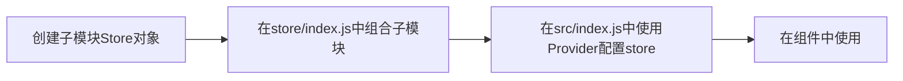

# React学习笔记

​		还是得记笔记，好记性不如烂笔头，之前学的React也仅限于会用，很多API的具体用法，原理还是忘，今年寒假4天把黑马出的React视频过一遍再做一个笔记。

## 初识React

React是meta(原facebook)公司开源的前端框架，跟vue相似都是基于虚拟DOM的。但是相对vue而言有这些优势

- 由于出现的比较早，社区资源更丰富，更流行
- 大公司构建，稳定性和扩展性更好
- 跟ts无缝集成
- 个人觉得写起来自由度更高，更贴近js原生

##  React入门

diff算法是用于比较两个数据集之间的差异的算法，应用场景如更新虚拟DOM、版本控制系统Git

uuid重复的概率使用生日悖论估计的话，1万亿条数据，生成的uuid重复的概率大概是9.4*10-14

### JSX是什么

​		JSX全称JavaScript XML，是一种由meta(原facebook)公司推出的一个JS语法扩展，它允许开发者在js代码中写类似于HTML的标记语法，这种语法在React中应用广泛，浏览器不能识别JSX代码，需要通过如Babel这种构建工具编译以后使用。基本的用法是类似于

```jsx
const titleText="Hello World";
const title=<h1>{titleText}</h1>;
```

需要注意的是，大括号只能插入表达式而不能插入语句，函数、变量、模版字符串这些都可以，但是不能写如{a=1}

### 初始化React项目

使用CRA创建React项目。（当然使用Vite也是可以的）

npx是npm的扩展，允许执行包中的命令而无需全局安装这些包，如果没有在执行过程中下载，执行命令完毕以后自动移除这个包。

使用npx初始化React项目的方式如下：

```bash
npx create-react-app my-app
```

使用pnpm初始化的命令（好像后面还会提示不兼容问题，还是用npx吧）

```bash
pnpm create react-app my-app
```

安装时候可能有点慢，三个包管理工具配置镜像源的命令

```bash
npm config set registry https://registry.npmmirror.com
pnpm config set registry https://registry.npmmirror.com
yarn config set registry https://registry.npmmirror.com
```

###  jsx的简单使用

**渲染列表**

返回使用小括号，不要使用中括号或者大括号

返回的是一个数组，react会自动解析渲染

```jsx
  const list = [
    { name: "张三", age: 18 },
    { name: "李四", age: 20 },
    { name: "王五", age: 22 },
    { name: "赵六", age: 24 },
  ];
  return (
    <div className="App">
      <ul>
        {list.map((item, index) => {
          // 加上key是为了方便diff算法，规范是必须加
          return (
            <li key={index}>
              姓名：{item.name}；年龄：{item.age}
            </li>
          );
        })}
      </ul>
    </div>
  );
```

**条件渲染**

```jsx
    import { useState } from "react";

    const [isShow, setIsShow] = useState(false); // 控制内容显示隐藏
    const handleClick = () => {
    setIsShow(!isShow);  // 修改状态
    };
    return (
    <div className="App">
      {/* {isShow && <div>应该展示的内容</div>} */}
      {/* 三目运算符 */}
      {isShow ? <div>应该展示的内容</div> : null}
      <button onClick={handleClick}>点击修改显隐</button>
    </div>
    );
```

**条件渲染+函数调用**

```jsx
  const type = 1;
  const returnData = (type) => {
    if (type === 1) {
      return <div>Hello 1</div>;
    } else if (type === 2) {
      return <div>Hello 2</div>;
    }
  };
  return <div>{type === 1 && returnData(type)}</div>;	// type为1时才进行函数调用
```

## React基础

### 基础Hooks的使用

####  useState

​		如果想要数据双向绑定的话，需要使用useState这个hook函数解构一个方法来修改状态（对于对象也是一样，一般都需要展开一下构建新对象赋值给原变量）

计时器案例

```jsx
  let [count, setCount] = useState(0);
  const handleDec = () => {
    setCount(--count);
  };
  const handleInc = () => {
    setCount(++count);
  };
  return (
    <div className="App">
      <button onClick={handleDec}>点我-1</button>
      <span style={{ color: "red", fontSize: "25px" }}>{count}</span>
      <button onClick={handleInc}>点我+1</button>
    </div>
  );
```

! 实现样式控制，需要注意的是，对于多个单词的如font-size，bgc这种都需要使用驼峰

**样式的扩展应用—classNames**

实际开发一般采用样式和代码分离，可以引入一个第三方库classNames，更方便的动态控制样式的显示隐藏

github：[classNames](https://github.com/JedWatson/classnames)

```bash
npm install classnames	# 引入
# 使用修改计数器案例
# index.css
.count-style{
    color: red;
    font-size: 25px;
} 

# App.js
import { useState } from "react";
import classNames from "classnames";
import "./index.css";

function App() {
  let [count, setCount] = useState(0);
  const countClass = classNames({ "count-style": count > 5 });	# 静态属性直接在前面添加
  const handleDec = () => {
    setCount(--count);
  };
  const handleInc = () => {
    setCount(++count);
  };
  return (
    <div className="App">
      <button onClick={handleDec}>点我-1</button>
      <span className={countClass}>{count}</span>
      <button onClick={handleInc}>点我+1</button>
    </div>
  );
}

export default App;
```

#### useRef

​		这个hook函数可以获取ref对象，拿到ref对象（常和副作用钩子结合使用）以后，可以做一系列操作，比如说给输入框聚焦，获取输入框的值、设置输入框的值等。

**发表评论案例**

```jsx
 let [comment, setComment] = useState("");
  const inputRef = useRef();  // 输入框对象
  const handlePublish = () => {
    console.dir(inputRef.current);  // 打印输入框对象
    // 发表完成以后聚焦，展示内容（一般是绑定value属性，onChange事件）
    const value = inputRef.current.value;
    inputRef.current.value = "";  // 清空输入框
    setComment(value);  // 更新显示值
    inputRef.current.focus(); // 聚焦
  };
  return (
    <div className="App">
      {/* 输入框和按钮 */}
      <input
        type="text"
        ref={inputRef}
        placeholder="输入一条友善的评论"
      ></input>
      <button onClick={handlePublish}>发表评论</button>
      {/* 展示内容区域 */}
      <div>{comment}</div>
    </div>
  );
```

#### useEffect

​		这个hook函数用于不是由事件引起而是由渲染引起的操作，如刚进来或DOM更新发送AJAX请求，DOM更新以后要执行的操作等等。类似于Vue的watch和生命周期钩子的作用。

**基础使用**

```jsx
// 模拟特定依赖项更新向后端重新请求数据
import { useEffect, useState } from "react";

function App() {
  let [goodList, setGoodList] = useState([
    {
      name: "小飞棍",
      count: 11,
    },
    { name: "山竹醇", count: 500 },
  ]);
  const handleDelete = () => {
    console.log("发出删除数据的请求")
    setGoodList(goodList.filter((item) => item.name !== "山竹醇"));	// 模拟删除并渲染
  };
  useEffect(() => {
    console.log("向后端重新请求数据");
  }, [goodList]);
  return (
    <div className="App">
      {goodList.map((item, index) => {
        return <div key={index}>{JSON.stringify(item)}</div>;
      })}
      <button onClick={handleDelete}>删除山竹醇</button>
    </div>
  );
}
```

useEffect三个不同依赖项的执行时机对应关系

| 依赖项         | 副作用函数执行时机                 |
| -------------- | ---------------------------------- |
| 没有依赖项     | 组件初始渲染时和组件更新时执行     |
| 空数组依赖     | 只在初始渲染时执行一次             |
| 添加特定依赖项 | 组件初始渲染和特定依赖项变化时执行 |

**清除副作用**

​		常用于定时器关闭、最后的收尾工作等,在回调函数中return一个函数

```jsx
const Son = () => {
  // 渲染时候开启一个定时器
  useEffect(() => {
    let intervalId = setInterval(() => {
      console.log("定时器执行中~~~");
    }, 1000);
    // 清除副作用
    return () => {
      clearInterval(intervalId);
    };
  }, []);
};
function App() {
  let [isShow,setIsShow]=useState(true)
  return (<div className="App">
  	{/* 控制组件是否卸载 */}
    {isShow&&<Son/>}
    <button onClick={()=>{setIsShow(!isShow)}}>更改定时器状态</button>
  </div>);
}
```


### 组件通信

#### 父传子

**1：父组件传递数据，在子组件上绑定属性（属性名任意）**

**2：子组件通过`props.属性名`接收数据**

```jsx
// 父亲给孩子起名字
const Son = (props) => {
  return <div>子组件——{props.name}</div>;
};

function App() {
  const pName = "这是父组件起的名字—张狗蛋";
  return (
    <div className="App">
      父组件
      {/* 子组件通过name属性传递变量pName */}
      <Son name={pName} />	
    </div>
  );
}
```

还可以实现类似于vue的默认插槽的效果，（具名插槽通过jsx实现）。

在父组件的子组件标签内写入jsx，子组件可以通过`props.children`属性访问

```jsx
const Son = (props) => {
  return (
    <div>
      我是子组件——{props.name}
      <br /> {props.children}
    </div>
  );
};

function App() {
  const pName = "这是父组件起的名字—张狗蛋";
  return (
    <div className="App">
      我是父组件
      <hr />
      {/* 子组件通过name传递变量pName */}
      <Son name={pName}>
        <div>我是默认内容</div>
      </Son>
    </div>
  );
}
```

！props可以传递任意类型的数据，包括jsx

！props是只读对象，修改只能通过子传父

#### 子传父

**1：父组件传递一个属性，这个属性绑定父组件的一个回调方法**

**2：子组件接收到这个方法，使用这个方法并进行传参**

子组件传参流程 onClick—>props.onGetName(sName)—>onGetName—>getName

```jsx
// 父传子和子传父结合，父向子传递名字，子传父修改名字
const Son = (props) => {
  const sName = "这是子组件的名字—AlbertZhang";
  return (
    <div>
      我是子组件——{props.name}
      {/* 点击触发父组件传递过来的onGetName */}
      <br /> <button onClick={() => props.onGetName(sName)}>点击改名字</button>
    </div>
  );
};

function App() {
  let [pName, setPName] = useState("这是父组件起的名字—张狗蛋");	// 使用这个钩子保证子组件响应式
  const getName = (sName) => {
    setPName(sName);
  };
  return (
    <div className="App">
      我是父组件
      <hr />
      {/* 父组件通过传递onGetName属性，onGetName方法触发getName回调函数 */}
      <Son name={pName} onGetName={getName}></Son>
    </div>
  );
}
```

！这里得父组件传递方法时不能加上()，不然Son组件渲染的时候这个就会直接调用

#### 兄弟通信

1：子传父通过属性函数传参把消息传递给父组件

2：父传子通过属性变量把消息传递给子组件

```jsx
// 给他兄弟起个名字	张二狗。useEffect函数是确保不要在渲染时候更改APP组件的状态
const Son1 = ({ onGetName }) => {
  const name = "张二狗";
  // 组件挂载时执行一次
  useEffect(() => {
    onGetName(name); // 调用传参的函数
  }, [onGetName,name]);
  return null;	// 只用于逻辑处理
};
const Son2 = (props) => {
  return <div>兄弟组件起的名字—{props.name}</div>; // 渲染姓名
};
function App() {
  let [name, setName] = useState(""); // 存储姓名
  return (
    <div className="App">
      父组件
      {/* 子传父 */}
      <Son1 onGetName={(sName) => setName(sName)} />
      {/* 父传子 */}
      <Son2 name={name} />
    </div>
  );
}
```

#### 爷孙通信

**1：使用createContext方法创建一个上下文对象**

**2：顶层组件通过Provider组件提供数据**

**3：底层组件通过useContext钩子函数使用数据**

```jsx
// 爷爷给孙子起名字
import { createContext, useContext } from "react";

const NameContext = createContext(); // 1. 创建上下文对象
const Dad = () => {
  return (
    <div>
      我是儿子
      <Son></Son>
    </div>
  );
};
const Son = () => {
  const name = useContext(NameContext);	// 3. 通过useContext使用数据
  return <div>我是孙子—{name}</div>;
};
function App() {
  const gName = "张爱国";
  return (
    <div className="App">
      {/* 2. 通过Provider组件提供数据 */}
      <NameContext.Provider value={gName}>
        我是爷爷
        <Dad />
      </NameContext.Provider>
    </div>
  );
}
```

### Redux

Redux是React配套的集中状态管理工具，它可以独立于React框架使用，但一般和React配合使用，类似于Vue里面的VueX。

为了简化Redux的配置，官方提供了RTK（Redux Toolkit）。

#### 基础使用

安装RTK和react-redux

```bash
npm i @reduxjs/toolkit react-redux
```

**计数器案例**

Redux的配置很繁琐，但是都是固定的，流程如下图



1：创建store—注意两个导出，一个导出actionCreater供组件使用、一个导出reducer供index里面组合

```js
import { createSlice } from "@reduxjs/toolkit";
const counterStore = createSlice({
  name: "counter",
  // 存储的状态
  initialState: {
    count: 0,
  },
  // 修改数据的同步方法
  reducers: {
    increment(state,action) {
      state.count+= action.payload;
    },
    decrement(state) {
      state.count --;
    },
  },
});

// 解构出创建action对象的函数
const { increment, decrement } = counterStore.actions;
// 获取reducer函数
const counterReducer = counterStore.reducer;
// 导出创建action对象的函数和reducer的值
export { increment, decrement };
export default counterReducer; // 用于全局挂载
```

2：在store/index.js中组合子模块—这个counter随便起，但是需要跟组件使用的时候对应

```jsx
import { configureStore } from "@reduxjs/toolkit";

import counterReducer from "./modules/CounterStore";

// 创建根store组合子模块
const store = configureStore({
  reducer: {
    counter: counterReducer,
  },
});

export default store;
```

3：在src/index.js中配置

```jsx
import React from "react";
import ReactDOM from "react-dom/client";
import App from "./App";
// 导入redux相关
import store from "./store";
import { Provider } from "react-redux";

const root = ReactDOM.createRoot(document.getElementById("root"));

// 将APP组件渲染到index.html中的id为root的根组件上面去
root.render(
  // 使用redux
  <Provider store={store}>
    <App />
  </Provider>
);
```

4：组件中使用

```jsx
import { useDispatch, useSelector } from "react-redux";
import { decrement, increment } from "./store/modules/CounterStore";

function App() {
  const { count } = useSelector((state) => state.counter); // 注意counter是store目录下配置的index.js中定义的
  const dispatch = useDispatch(); //获取调用执行函数的dispatch
  // 注意是调用，这里return不return都行。
  const handleDec = () => {
    dispatch(decrement());
  };
  /* 
   返回一个函数，这个函数是匿名函数，value之前传递了过来，这个时候onClick的回调函数调用的就是这个
    () => {
      dispatch(increment(value));
    }
  */
  const handleInc =
    (value) =>
    () => {
      dispatch(increment(value));
    };

  return (
    <div className="App">
      <button onClick={handleDec}>点我-1</button>
      <span style={count > 5 ? { color: "red", fontSize: "25px" } : {}}>
        {count}
      </span>
      <button onClick={handleInc(1)}>点我+1</button>
      <button onClick={handleInc(10)}>点我+10</button>
    </div>
  );
}

export default App;

```

关于回调函数传参的问题

当写 `onClick={handleInc(10)}` 时，实际上是在渲染时调用 `handleInc` 函数，并将返回值（如果有的话）设置为 `onClick` 事件的处理函数。如果 `handleInc` 直接调用了 `dispatch`，那么每次组件渲染时都会执行 `dispatch`，从而导致状态更新、组件重新渲染、再次调用 `dispatch`，形成一个无限循环。我们期望的是回调函数，采用函数柯里化技术

**函数柯里化（Function Currying）技术**。函数柯里化是一种在函数式编程中常用的技术，允许你将一个接受多个参数的函数转换成一系列使用一个参数的函数。

```jsx
// 改装之前
function add(a, b, c) {
  return a + b + c;
}

const result = add(1, 2, 3); // 6
// 改装后
function curriedAdd(a) {
  return function(b) {
    return function(c) {
      return a + b + c;
    };
  };
}
const result = curriedAdd(1)(2)(3); // 6

const curriedAdd = a => b => c => a + b + c;	// 使用箭头函数简化，箭头函数会返回紧跟着箭头的第一个表达式的结果，如果不用{}包裹的情况下
```

#### **异步调用**

​		异步调用需要改装store和原来的调用，也是固定格式。假如我们需要获取一个频道列表

ChannelStore.js

```js
import { createSlice } from "@reduxjs/toolkit";

const channelStore = createSlice({
  name: "channel",
  initialState: {
    channelList: [],
  },
  reducers: {
    setChannels(state, action) {
      state.channelList = action.payload;
    },
  },
});

const { setChannels } = channelStore.actions;
const url = "http://geek.itheima.net/v1_0/channels";
const fetchChannelList = () => {
  return async (dispatch) => {
    const res = await fetch(url); // 浏览器自带请求api
    const channelList = await res.json();
    dispatch(setChannels(channelList.data.channels));
  };
};
const channelReducer = channelStore.reducer;
export { fetchChannelList }; // 暴露出这个方法供组件使用

export default channelReducer; // 暴露这个供index组合
```

store/index.js注册

```js
import { configureStore } from "@reduxjs/toolkit";

import counterReducer from "./modules/CounterStore";
import channelReducer from "./modules/ChannelStore";

// 创建根store组合子模块
const store = configureStore({
  reducer: {
    counter: counterReducer,
    channel: channelReducer,
  },
});

export default store;
```

组件使用

```jsx
import { useDispatch, useSelector } from "react-redux";
import { fetchChannelList } from "./store/modules/ChannelStore";
import { useEffect } from "react";

function App() {
  const dispatch = useDispatch();
  const { channelList } = useSelector((state) => state.channel);
  // 组件挂载时触发一下（这里根据需求何时触发）
  useEffect(() => {
    dispatch(fetchChannelList());
  }, [dispatch]);

  return (
    <div className="App">
      <ul>
        {channelList.map((item) => {
          return <li key={item.id}>{item.name}</li>;
        })}
      </ul>
    </div>
  );
}

export default App;
```

### React Router

## React进阶

### 扩展hook函数

### 类组件

### zustand

## 项目实战

### 初始化

### 开发规范

### 注意点

